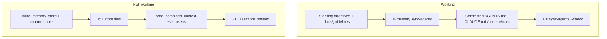

# Evaluation: guidelines + memory-fabric in this project

**Verdict:** the **guidelines system works**; the **memory system is only half-working**. Policy reaches agents. Facts are written, reviewed in git, and scored well — then starved at retrieval time.

`ai-memory eval` today: **88/100 pass**. That score measures store hygiene (maps, metadata, coverage). It does **not** measure whether an agent in a real session actually sees the right memory. This session’s own `read_combined_context` is the proof: with a topical query, **5 sections included, ~100 omitted** for budget. The giant journal [`episodic/2026-07-24`](.ai-memory/memory-store/episodic/2026-07-24.md) ate the budget; architecture maps, failures, and current decisions collapsed to one-line stubs.

---

## 1. What is functioning well

### Guidelines (the compiler) — strong

Field history from 2026-07-24 → 2026-07-27 shows the design surviving real failure, then feeding **upstream**:

- Single source of truth (`.ai-memory/*` with `role: steering`) compiled into every tool’s native file.
- Generated files **committed** (after the gitignore blocker was found). Clone-and-open works without MCP.
- CI `agent-rules-drift` (`ai-memory sync-agents --check` in [`.gitlab-ci.yml`](.gitlab-ci.yml)) is the real enforcement, not “hope the model remembers.”
- Layering is correct: tiny always-on core ([`development-guidelines.md`](.ai-memory/development-guidelines.md)) + pointers to [`docs/guidelines/*.md`](docs/guidelines/) + optional skills.
- A real onboarding failure (other machine still had old untracked `CLAUDE.md`; agent claimed it “needed MCP”) produced **Rule 0** in memory-fabric 1.1.2 — this project is the dogfood that improved the product.
- Test protocol in [`docs/AGENTS_SETUP.md`](docs/AGENTS_SETUP.md) is unusually good: questions that contradict the codebase majority (`test_*.py` vs `tests_*.py`).

This is the piece to replicate elsewhere.

### Memory (the store) — good at writing, weak at reading

What *does* work:

- Store-first model: 151 granular files, steering vs facts split, maps as views.
- Failure memories exist and are useful when fetched (Oracle 30-char, Alpine DOM, HTMX auto-save, semantic-merge false-green tests).
- Architecture decisions are real ADRs (CAD vs system columns, fase locks, `cod_eleicao`).
- Passive git capture + merge driver + `verify` evidence are the right *ideas*.
- Eval 88, metadata 97, coding_usefulness 95 — the *files* are in decent shape.

---

## 2. What is not working (this repo as evidence)

These are not theoretical. They showed up in this project’s history and in this session.

### A. Retrieval collapses under its own success

- Default combined context is **above budget** (eval warn). Mandatory startup `read_combined_context` at 151 files includes a few full docs and a wall of “omitted … summary:”.
- Query ranking is keyword-overlap. A long journal that mentions “sync-agents / guidelines” outranks the architecture map. BM25 here has **no IDF** — common words and huge files win.
- `read_combined_context` **parses every file first**, then trims. Roadmap Phase 4 already measured p95 ~390 ms at 500 files / ~740 ms at 1000. This repo is on that curve.
- Keyword search still hits **stale candidates** from 2026-08-04 (`.ai-memory/candidates/.../consolidated_memory.md`) — noise in the retrieval path.

Net: agents are *told* to load memory every session, then get a truncated dump that looks complete. That is worse than a miss: it creates false confidence.

### B. Maps and citations rot between dreams

Eval failures right now:

- Stale generated maps: `architecture.md`, `episodic.md`, `failures.md`, `rules.md`, `schemas.md`.
- Broken `evidence` on 4 files (cross-repo `agregacao/` paths, a migration not on this branch, a renamed template).
- Duplicate summaries both literally `"Contexto"` (two decisions).

Post-commit light dream is supposed to refresh maps. It is not keeping up — either hooks are not installed on every clone, light dream does not regenerate every map, or agents write memory *after* the commit (this conversation’s git status showed uncommitted `.ai-memory/` writes).

### C. Episodic capture without consolidation

- ~75 episodic entries; most commit captures tagged `needs-review` / `passive-capture`.
- Deep-dream roll-up (weekly files, 14-day cutoff) exists in the product but barely runs here. Documented reasons: LM Studio timeout (600s vs 180s default), `n_keep >= n_ctx`, MCP Sampling deadlock → split-tool protocol.
- Result: the store is a **commit log**, not a project brain. Agents almost never read `episodic/commits/<hash>`.

### D. Protocol is too heavy and often bypassed

Always-on Cursor surface today:

1. [`.cursor/rules/memory-fabric.mdc`](.cursor/rules/memory-fabric.mdc) — full protocol
2. [`.cursor/rules/project-directives.mdc`](.cursor/rules/project-directives.mdc) — full guidelines
3. MCP `read_combined_context` — another 4k
4. Same protocol again inside `AGENTS.md` / `CLAUDE.md` if those also load

Plus GitNexus, skills, and `docs/guidelines`. There is **no router**: “code how?” vs “why did we decide?” vs “what is the golden rule?”

And the protocol is routinely violated: agents still write `.ai-memory/` with file tools (git status at session start). Instruction-only “NEVER use file tools” fails the same way Phase 3 predicted — long sessions compress the rule away. Cursor Stop-hooks for `guard-journal` are still **held** upstream (open SessionStart bug). This team is Cursor-heavy, so the capture-enforcement that works for Claude Code/Codex does not apply.

### E. Quality bugs in captured content

- Portuguese slugs mangled: `se-o`, `importa-o`, `gr-fico`, `su-te-de-apps` — ASCII slugger eats accents, titles get truncated to the first line.
- Failure `occurrences` almost always `1` — signature normalization is too strict or agents rephrase, so the “highest-ROI category” rarely accumulates.
- Skills ([`.agents/skills/`](.agents/skills/)) are a third channel, not compiled by `sync-agents`, easy to drift from `docs/guidelines/frontend.md`.
- GitNexus index 31 commits behind — complementary tool, same “stale index” class as stale maps.

### F. Dual-write cost in git

Every session can dirty `.ai-memory/` independently of the feature. Memory bookkeeping commits were fixed in 1.0.0 (skip pure-memory commits), but mixed code+memory diffs still inflate MRs and confuse review.

---

## 3. Improve this project (without waiting on new product)

Do these even if memory-fabric stays as-is:

1. **Stop treating combined context as mandatory full dump.** Agents should `keyword_search` → `read_memory_store` for the task; combined context only for steering + a compact index. (Product should make this the default — see below.)
2. **Run `ai-memory dream --mode light --apply` (or deep via split-tool) on a cadence** so maps are not stale; then `ai-memory verify` to clear broken evidence.
3. **Install hooks per clone** (`ai-memory init --install-hooks --merge-driver`) and document it as required, not optional, in [`docs/AGENTS_SETUP.md`](docs/AGENTS_SETUP.md).
4. **Tighten summaries.** Ban `"Contexto"`; require one specific sentence. Eval already warns.
5. **Keep steering tiny.** Do not grow `development-guidelines.md`. New conventions go to `docs/guidelines/` or `memory-store/rules/`.
6. **Separate “policy MR” from “memory bookkeeping”** so feature review stays readable.
7. **Add a one-page agent router** (guideline vs memory vs GitNexus vs skill) — can live as a short steering addendum or a skill, not more always-on tokens.

---

## 4. Enhance memory-fabric (product, ranked by this repo’s pain)

Phase 4 in [agentic-memory `ROADMAP.md`](/home/rafael/Projetos/git/agentic-memory/ROADMAP.md) is still unchecked and is exactly what this dogfood needs. Suggested order, driven by gerenciador-eleicao:

### P0 — Retrieval that scales (Phase 4, first)

- **Frontmatter index, lazy body load.** Stop parsing 151 files to fill 4k tokens.
- **Startup context = steering + generated maps only** (the maps are the ToC). Granular files load on search. Today maps are generated then omitted — inverted.
- **Real BM25 with IDF + recency + priority**; cap any single file (journals especially) so one 8k journal cannot monopolize the budget.
- **Exclude `candidates/` from search.**
- **Query required for store packing**; no-query mode should not dump journals.

This is the difference between “memory exists” and “agents use memory.”

### P0 — Cursor-class lifecycle hooks

Capture-rate proof is 100% on Claude Code/Codex/Gemini. This project’s daily driver is Cursor. Until Cursor SessionStart/Stop adapters ship (or a Cursor plugin equivalent), journaling stays instruction-only and will keep failing.

### P1 — Make maps and verify automatic

- Light dream after **any** store write (not only post-commit), or a file-watcher / MCP `write_*` hook that dirties map fingerprints and regenerates cheaply.
- `ai-memory verify` in CI (like `sync-agents --check`), fail on `broken-evidence` for in-repo paths; allow `repo:` prefixed citations for sister repos (`agregacao/`).
- Doctor warn when `needs-review` passive captures exceed N and last deep dream is older than M days.

### P1 — Capture quality, not just capture rate

- Unicode-safe slugs (`seção` → `secao`, not `se-o`).
- Better failure signatures (normalize stack type + exception class, not truncated Portuguese prose).
- Auto-summaries for `write_memory_store` when summary is `"Contexto"` or equals the first heading.
- Promote `review_status: pending` into a real queue: `ai-memory review` CLI / MCP tool that an agent or human can accept → promote commit capture into `architecture/` or `failures/`.

### P1 — Cut always-on token duplication

- `sync-agents` should emit **one** Cursor rule, or a thin `memory-fabric.mdc` that says “follow project-directives + Rule 0” instead of pasting the full protocol twice.
- Optional `MEMORY_FABRIC_SKIP_STARTUP_DUMP=1` now that MCP Resources can auto-fetch context (the protocol already mentions this; make it the default when the resource is present).

### P2 — Dreaming that actually runs

- Default deep dream to **split-tool** when no healthy LLM, instead of a 180s hang.
- Candidate stores: TTL + `doctor` “delete stale candidates”; never search them.
- Contradiction detection (roadmap) — this repo already has reversals (`urnas_add_pos_calc` PRD 0008 vs 0009).

### P2 — Temporal facts + lifecycle (roadmap)

`valid_from` / `superseded_by`, access-count decay. Debt entries marked “resolvido” still sit at `priority: high` and compete with live facts.

---

## 5. New tools (in memory-fabric or beside it)

Not everything belongs inside memory-fabric. Keep the file-first, git-native niche.

| Tool | Where | Why this project needs it |
|---|---|---|
| **`ai-memory retrieve` / `context_for_task(query, files_open)`** | memory-fabric MCP | Replace mandatory full dump with task-scoped pack: steering + top-k store + relevant guideline pointers. |
| **`ai-memory review`** | memory-fabric CLI | Drain `needs-review` captures into real ADRs/failures; today the tag has no consumer except rare deep dreams. |
| **Guideline canary in CI** | memory-fabric or this repo | Scripted prompt against a cheap model: “what should a new test file be named?” Must answer `test_*.py`. Catches load failures the drift check cannot. |
| **Agent router skill** | this repo / a small pack | `guidelines` vs `memory` vs `GitNexus` vs `skill`. GitNexus answers “how does this function run?”; memory answers “why did we choose MERGE-by-CPF?” Mixing them wastes tools. |
| **sync-agents → skills index** | memory-fabric | Optional: compile a short “available skills” list into the always-on core so agents know `.agents/skills/` exists. |
| **Coding-memory benchmark** | standalone (roadmap Phase 5) | This repo is a ready fixture: later session must recall TOT_LOCAL CAD-vs-system columns, `test_*.py`, no DRF. Publish memory-on vs memory-off. |
| **Do not build a second generator** | — | A repo-local AGENTS.md writer will fight `sync-agents` and the pre-commit hook. Already decided 2026-07-24. |

GitNexus stays a **sibling**, not a merge: code graph vs project brain. A thin router is enough; a unified database is not.

---

## 6. Bottom line

| Layer | Grade | Copy to another project? |
|---|---|---|
| Guidelines compiler (source → sync-agents → committed files → CI `--check`) | A | Yes, first |
| Deep-dives + skills layering | A- | Yes |
| Memory *write* path (store-first, capture, failures, ADRs) | B+ | Yes, with hygiene |
| Memory *read* path (combined context, ranking, budget) | D | Not until Phase 4 retrieval |
| Cross-tool hook enforcement (Cursor) | C | Claude/Codex yes; Cursor not yet |

The architecture choice from 2026-07-24 still looks right: **policy as committed files, not MCP; memory as git-reviewable markdown, not a vector cloud.** The gap is that memory volume outgrew the original “dump the store into the prompt” retrieval model. Fix retrieval and review-queue, and this stack becomes what the roadmap claims: a project brain. Until then, treat memory as a **searchable wiki agents must query**, not as automatically loaded wisdom.